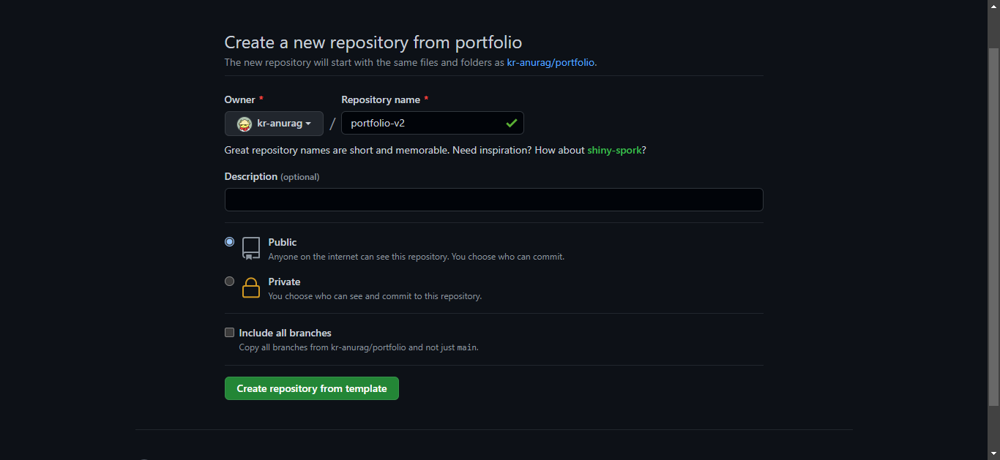
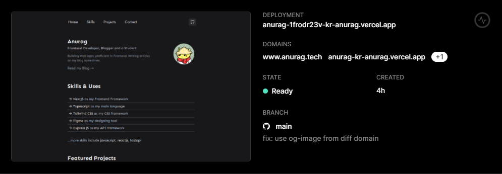

### Using the Portfolio Template

First, click on the `Use this template` button


Now choose a name for your repo and create.



### Running locally

- Clone the repo locally first

```git
git clone <url>
```

- Install the dependencies

```
npm install # for npm
yarn install # for yarn
```

- Start the server

```
npm run dev # for npm
yarn dev # for yarn
```

## Making changes

To add your details go to the data.json file in the public folder and replace my data with yours.

To customize the colors go to `tailwind.config.js` and replace the existing colors with your brand colors.

After you have added all your data. Push the code to GitHub with these commands

```
git add .
git commit -m "your commit message"
git push
```

## Deploying

- Go to [Vercel](https://vercel.com/dashboard)
- Sign up for an account
- Click on New project
- Import your repository
- Click skip while creating a team and then hit deploy
- After it is deployed click on go to dashboard
- Your site is successfully deployed 🥳
- Now grab the URL and show it to world



### Bonus ⭐

This portfolio template contain a Spotify Card component [here](./components/Misc/Spotify.card.tsx) which shows the current streaming song on spotify.

**Example:**


To configure this, you need to connect spotify to your discord account and add your User ID to the component.

In the [Spotify.card.tsx](./components/Misc/Spotify.card.tsx) component, change the following line:

```js
const DISCORD_ID = "<your_discord_id>";
```

And you're good to go!